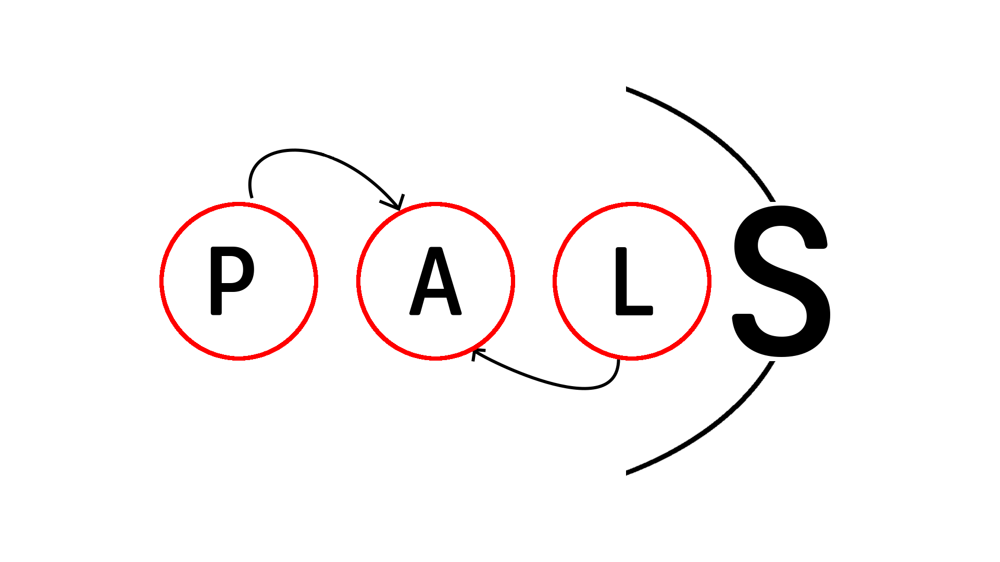

  

<h1 align="center">PALS</h1>

  <em>Preference-guided Active automata Learning for Symbolic reinforcement learning</em>

## Abstract

We introduce *PALS* (Preference-guided Active automata Learning for Symbolic
reinforcement learning), an active automata learning framework that learns
fully-symbolic policies for goal-directed games from a preference oracle and LTL
safety specifications. *PALS* extends classical L\* by allowing both the
hypothesis and the preference oracle to evolve as queries accumulate, with an
MCTS-driven audit stage that surfaces deviations preferred over the current
hypothesis and a shielding layer that patches the oracle whenever the hypothesis
violates the safety specification. We demonstrate the utility of *PALS* on the
Taxi Driver game from the Gymnasium benchmark, evaluate it against standard
Q-learning and MCTS baselines on a suite of game-theoretic benchmarks, and
provide a proof establishing local optimality and polynomial query time under
modest assumptions on the game structure. To the best of our knowledge, *PALS*
is the first algorithm that fully symbolically learns reinforcement-learning
policies for agents in games via automata learning.
