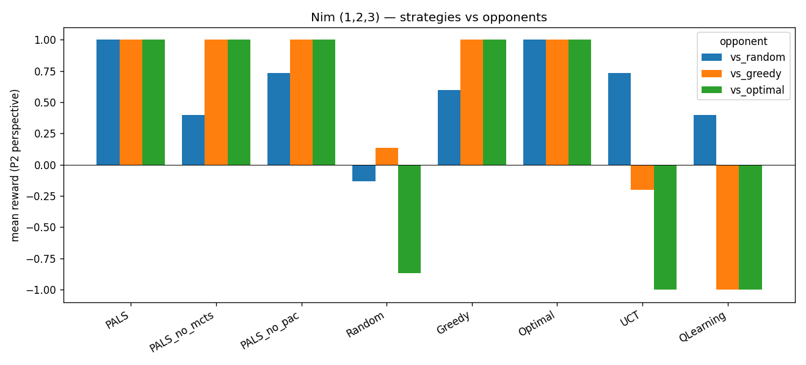
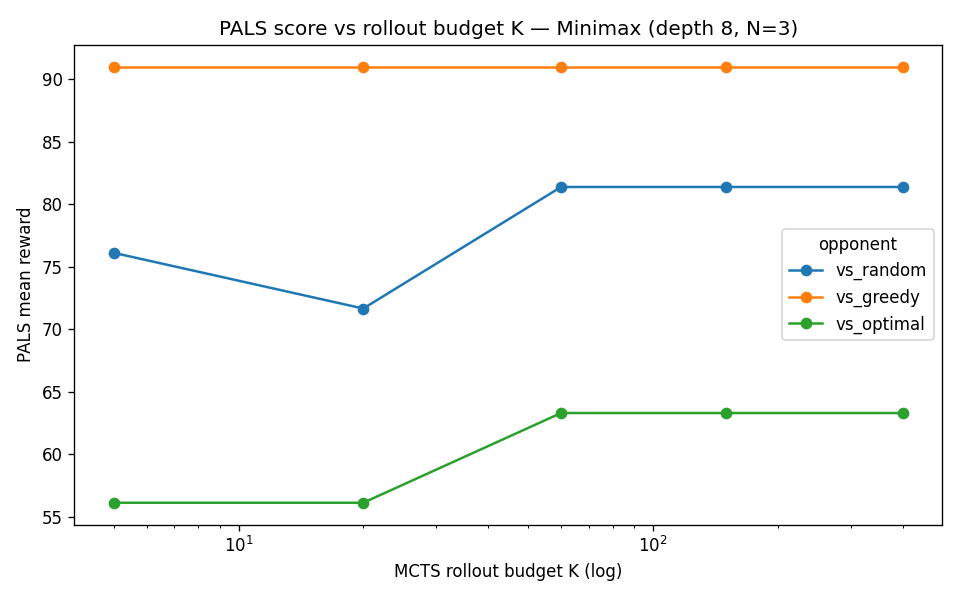
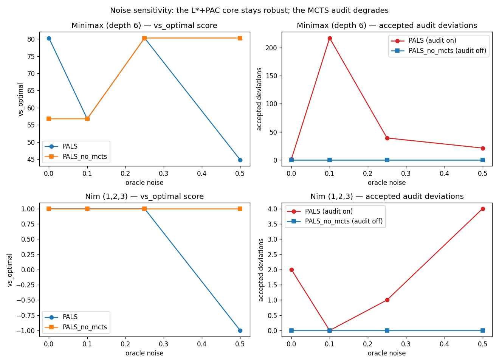
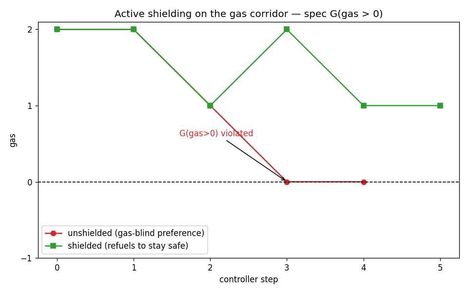
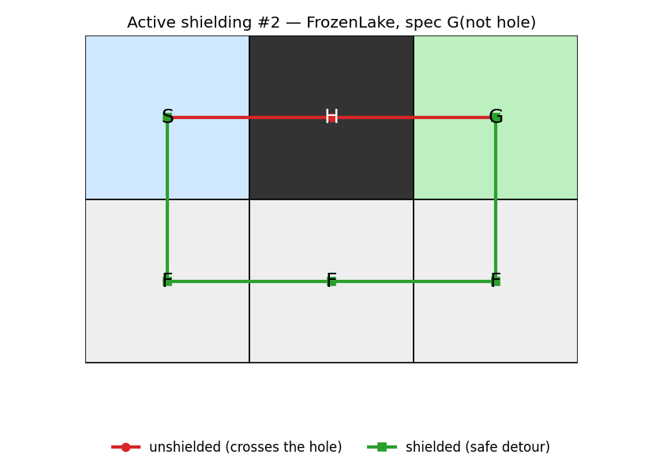

<p align="center">
  
</p>

<h1 align="center">PALS</h1>

<p align="center">
  <em>Preference-guided Active automata Learning for Symbolic reinforcement learning</em>
</p>

## Abstract

We introduce *PALS* (Preference-guided Active automata Learning for Symbolic
reinforcement learning), an active automata learning framework that learns
fully-symbolic policies for goal-directed games from a preference oracle and LTL
safety specifications. *PALS* extends classical L\* by allowing both the
hypothesis and the preference oracle to evolve as queries accumulate, with an
MCTS-driven audit stage that surfaces deviations preferred over the current
hypothesis and a shielding layer that patches the oracle whenever the hypothesis
violates the safety specification. We demonstrate the utility of *PALS* on the
Taxi Driver game from the Gymnasium benchmark, evaluate it against standard
Q-learning and MCTS baselines on a suite of game-theoretic benchmarks, and
provide a proof establishing local optimality and polynomial query time under
modest assumptions on the game structure. To the best of our knowledge, *PALS*
is the first algorithm that fully symbolically learns reinforcement-learning
policies for agents in games via automata learning.

## Results

PALS learns a fully-symbolic policy from a *suboptimal* preference oracle and
recovers strong play. On Nim it matches optimal play across opponents, while the
MCTS-audit ablation (`PALS_no_mcts`) drops sharply — the audit is what lifts the
suboptimal oracle to optimal:



The MCTS rollout budget `K` trades compute for quality (and then saturates):



Under a *noisy* (inconsistent) oracle, the `L*`+PAC core stays robust while the
MCTS audit degrades — its accepted deviations explode and its quality can drop
below the audit-off core. This scopes the audit's termination guarantee
(Theorem 2 assumes consistent preferences):



The shielding layer enforces a safety spec the preference oracle ignores. Here the
gas-blind policy runs the tank to zero (`G(gas>0)` violated); the shield inserts a
single refuel to stay safe **and still delivers**:



A second shielding demo on Gymnasium's (non-slippery) FrozenLake: the hole-blind
policy walks straight through a hole (`G(not hole)` violated), while the shielded
controller detours around it with a single patch **and still reaches the goal**:



Regenerate with `pip install -e ".[viz]" && python -m scripts.plot_benchmarks`.

## Getting started

```bash
pip install -e ".[dev]"     # z3-solver, gymnasium, pytest, ruff
pytest                      # run the test suite
ruff check . && ruff format --check .
python -m scripts.run_benchmarks --quick   # results tables + shielding demo
```

## Repository

| Path | Contents |
|---|---|
| `pals/core/` | Mealy L\*, mutable SUL, Table B, SMT valuer, preference oracle, `run_pals` |
| `pals/oracles/` | equivalence oracles: MCTS audit, PAC, composite, bounded-exact |
| `pals/shielding/` | safety-game solver, model checker, shield oracle, spec |
| `pals/envs/` | Nim, Tic-Tac-Toe, Dots & Boxes, Minimax, gas-grid, FrozenLake (behind one `Environment` ABC) |
| `pals/bench/` | players/baselines, evaluation, benchmark harness, noisy-oracle wrapper |
| `docs/` | holistic review, build plan, paper-alignment guide, results |

See `docs/01_holistic_review.md`, `docs/02_build_plan.md`, and
`docs/03_paper_alignment.md` for design and camera-ready notes.
